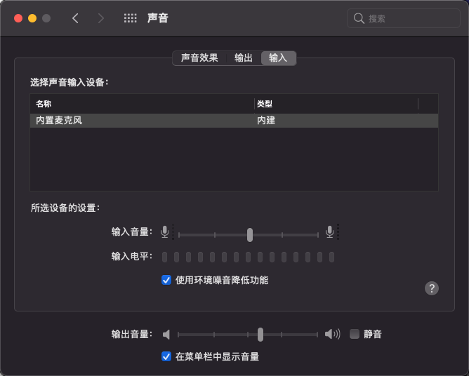

# Opencore EFI For Hasee Z7M-CT7Nk( 系统已持续更新到BigSur11.2.3 )

- [想了解原机配置请点击](http://detail.zol.com.cn/notebook/index1278707.shtml) 
Opencore版本：0.6.3  
已关闭CFG（相关参考教程：[从Clover到OC （重难点：Insyde BIOS 解锁CFG Lock)](https://zhuanlan.zhihu.com/p/121655468)

# 正常工作的部分：
- 声卡（由applealc.kext驱动，注入ID：19
- 内置键盘和触控板手势
- USB3.0/USB2.0
- 内置摄像头
- 电池状态
- 原生电源管理（可参考教程：[手把手教你 黑苹果加载原生电源管理，开启节能五项！](https://macx.top/8842.html)）
- 背光控制
- 核显驱动(亮度可调，已开启hidpi 2048m显存）
- 独显（GTX1650）无解，已屏蔽
- 有线网卡
- 无线网卡（BCM943602CS + 反向转接卡，D壳需要磨薄一点，安装时切不可强行扣回D壳）
- Apple Store和iCloud正常使用
- 触控板手势（目前状态为设置中勾选“有鼠标或者无线触控板时忽略内建触控板”时拔掉鼠标后触控板无反应，不勾选则一切正常）
- 随航

# 未能正常工作的部分：
- GTX1650:懂的都懂，无解

# 原机配件有解部分：
- 原机所配的AC9462，现在的intel无线网卡也有解决方法，好像支持接力

# 备注
- Insyde的bios关闭CFG可参考以下文章：https://zhuanlan.zhihu.com/p/121655468
# 配部分图片：
 
 
 
 
 
 
 
   
 
 

